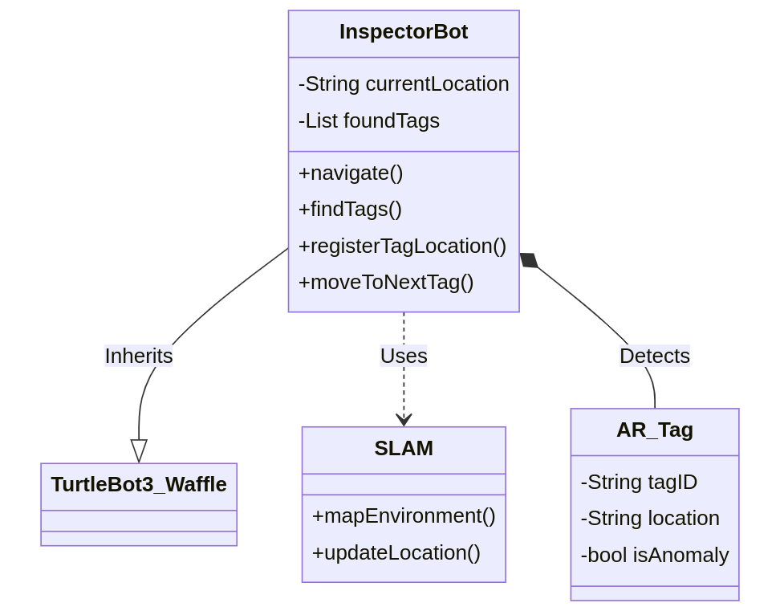
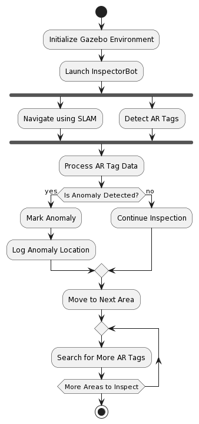
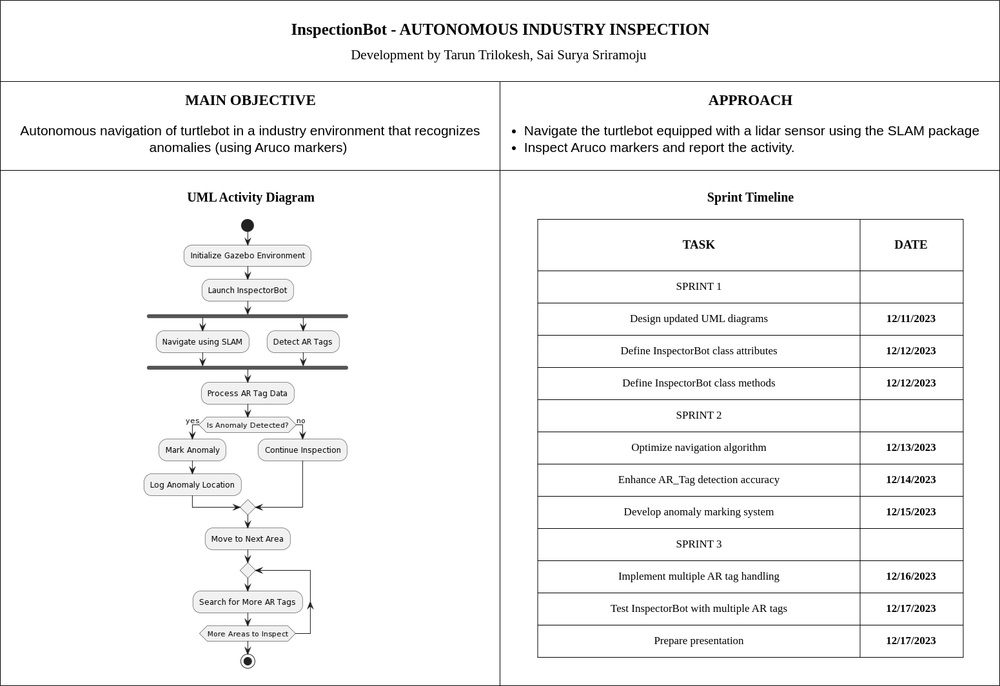

# InspectorBot: Autonomous Industry Inspection System

[](https://opensource.org/licenses/MIT)

[](https://codecov.io/gh/tarunreddyy/inspection_bot)

InspectorBot is an innovative autonomous robot designed for efficient and accurate industry inspection. Utilizing advanced SLAM (Simultaneous Localization and Mapping) techniques, InspectorBot navigates industries autonomously, identifying and marking anomalies using ArUco markers.

## Team Details

| Team Members |
|---|
| Sprint 1 |
| **Tarun Trilokesh - 118450766** (Driver) |
| **Sai Surya Sriramoju - 119224113** (Navigator) |
| Sprint 2 |
| **Tarun Trilokesh - 118450766** (Navigator) |
| **Sai Surya Sriramoju - 119224113** (Driver) |

## UML Diagram

The UML diagram illustrates the architecture and interaction of classes within InspectorBot.


## Activity Diagram

The activity diagram demonstrates the workflow of InspectorBot, highlighting the steps involved in autonomous navigation and anomaly detection.


## Quad Chart

The quad chart provides a visual summary of InspectorBot's capabilities and development progress.


## Product Backlog

[Product Backlog Google Sheet](https://docs.google.com/spreadsheets/d/1riEoFAD4eDPTp7oa7tnZANUklh0wJGMXKnpVL7vbjc4/edit?usp=sharing)

## Sprint Review

[Sprint Review Doc](https://docs.google.com/document/d/1LO78YJ8UPMQ4lM8xCVnNeccR0AnmnZlA-wpxU4um7co/edit?usp=sharing)

## The video explanation of the phase one of this project can be found [here](https://drive.google.com/file/d/1vZ3_9K9WZzgpQl5QuAfxAEsRZVFMnTK0/view?usp=sharing)

## Technologies and Tools

- **Programming Language**: Python, C++
- **Robot Operating System**: ROS 2 Humble Hawksbill
- **SLAM Technology**: SLAM Toolbox
- **Simulation**: Gazebo
- **Version Control**: Git, GitHub

## Dependencies

- ROS 2 Humble Hawksbill (https://docs.ros.org/en/humble/index.html)
- Gazebo (http://gazebosim.org/)
- SLAM Toolbox (https://github.com/SteveMacenski/slam_toolbox)
- TurtleBot3 packages

## Installation and Execution

Follow these steps to set up and run the InspectorBot:

```bash
# Clone the repository:
  git clone https://github.com/tarunreddyy/inspector_bot.git
  cd inspector_bot

# Build the project:
  colcon build
  source install/setup.bash

# Launch the InspectorBot in Gazebo:
  ros2 launch inspector_bot launch_inspection_bot.launch.py
# run the inspector bot node:
  ros2 run inspection_bot inspector_bot_node
# run the aruco detection node:
  ros2 run inspection_bot detect_aruco
```

## Key Features

- Autonomous navigation in industrial environments using SLAM.
- Anomaly detection and marking using ArUco markers.
- Integration with Gazebo for realistic simulation.
- Continuous integration and code coverage setup on GitHub.

## Collaboration Strategy

Our team employs agile methodologies, with a focus on pair programming and regular sprint reviews to ensure alignment with project goals and efficient progress.
